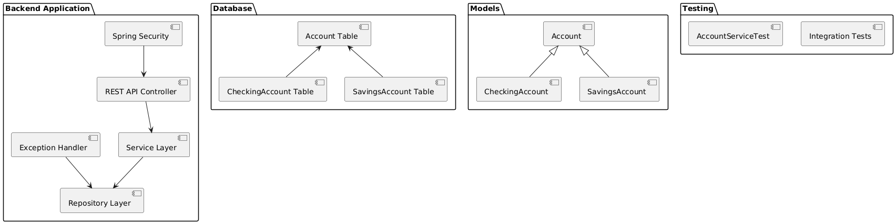

# Bank Account - Manage - Backend

## A. Description of the Project

This project is a backend application developed using Java and Spring Boot. It follows REST API best practices and provides CRUD operations for managing accounts, including different types of accounts (Checking Account and Savings Account). The application uses JPA inheritance to handle the parent-child relationship among models. It also includes robust error handling, authentication using JWT with Spring Security, and is tested with unit and integration tests. Data is stored in a MySQL database.

## B. Class Diagram

 <!-- Make sure to replace with an actual path or URL to your class diagram image -->

The class diagram represents the inheritance structure between `Account` (parent class), `CheckingAccount`, and `SavingsAccount` (child classes). It also includes repositories and services for handling business logic and data access.

## C. Setup

### Prerequisites

- Java 11+
- Maven
- MySQL

### Steps

1. **Clone the repository:**
   ```bash
   git clone https://github.com/Joseph0x90/java-project-github-repo-amazon.git
   cd java-project-github-repo-amazon
   ```

2. **Configure the database:**
   - Create a MySQL database named `ecommerce_db`.
   - Update the `application.properties` file with your MySQL username and password.

3. **Build the project:**
   ```bash
   mvn clean install
   ```

4. **Run the application:**
   ```bash
   mvn spring-boot:run
   ```

5. **Access the API:**
   The API will be available at `http://localhost:8080/api/accounts`.

## D. Technologies Used

- Java
- Spring Boot
- Spring Data JPA
- MySQL
- Spring Security (JWT)
- JUnit and Mockito (Testing)
- Maven

## E. Controllers and Routes Structure

### AccountController

| HTTP Method | Endpoint              | Description                |
|-------------|-----------------------|----------------------------|
| GET         | /api/accounts         | Retrieve all accounts      |
| GET         | /api/accounts/{id}    | Retrieve account by ID     |
| POST        | /api/accounts         | Create a new account       |
| PUT         | /api/accounts/{id}    | Update an existing account |
| DELETE      | /api/accounts/{id}    | Delete an account by ID    |

### AuthenticationController

| HTTP Method | Endpoint            | Description                 |
|-------------|---------------------|-----------------------------|
| POST        | /api/auth/login     | Authenticate and get token  |
| POST        | /api/auth/register  | Register a new user         |

## F. Extra Links

- [Trello Board](https://trello.com/your-trello-board-link)
- [Presentation Slides](https://docs.google.com/presentation/your-presentation-link)

## G. Future Work

- Implement additional features such as order management, product catalog, and payment processing.
- Enhance security measures and implement role-based access control.
- Improve performance with caching mechanisms.
- Deploy the application using Docker and Kubernetes.

## H. Resources

- [Spring Boot Documentation](https://docs.spring.io/spring-boot/docs/current/reference/htmlsingle/)
- [Spring Data JPA Documentation](https://docs.spring.io/spring-data/jpa/docs/current/reference/html/)
- [MySQL Documentation](https://dev.mysql.com/doc/)
- [JWT Introduction](https://jwt.io/introduction/)

## I. Team Members

- **Yousif Abdullah** - [yousif.abdullah9698@gmail.com](mailto:yousif.abdullah9698@gmail.com)
